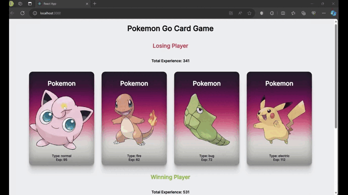

# PokemonGameReactProject

<!DOCTYPE html>
<html lang="en">
<head>
    <meta charset="UTF-8">
</head>
<body>
    
  
Pokemon karakterlerinin olduğu bir web sitesi... 

<h2 id="built-with">Built With</h2>
  <ul>
    <li>HTML</li>
    <li>CSS</li>
    <li>JAVASCRIPT</li>
    <li>REACT</li>
  </ul>
  <!-- 
You can reach to Website, when you are click <a href="https://pokedex-guiide.netlify.app/">HERE</a>.
 -->

</body>
</html>

<!-- Screenshot  -->
# pokemonReact
